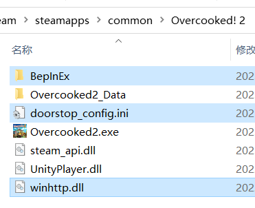

# 胡闹厨房2 - 喷气背包模组

## 安装

1. 安装 BepInEx 5 (x86)（[GitHub](https://github.com/BepInEx/BepInEx/releases) 或 [百度网盘链接](https://pan.baidu.com/s/1G81rpJNwVsJplJi6fD2jPA?pwd=lobe)），解压后拷贝到游戏根目录下

   

       
   

   > 开启 `BepInEx` 的控制台可能会导致无法以手柄进入游戏。确保配置文件 `BepInEx/config/BepInEx.cfg` 中 `[Logging.Console]` 组中值为 `Enabled = false`。

2. 将 `OC2Jetpack.dll` 拷贝到 `BepInEx\plugins` 文件夹中即可

## 使用

- 在游戏键位设置中键盘 / 切分键盘可以设置喷气键。手柄玩家需在此处设置一键盘按键，并在 `Steam - 库 - Overcooked! 2 - 控制器布局` 中将手柄按键映射到此键盘按键。
- 长按喷气键升空，短按喷气键滞空。
- 客机需要主机也安装才可使用。
- 启动游戏时默认禁用，或者可以在键位设置时按 `Esc` 设为禁用。禁用时不改变原始游戏逻辑。
- 在 `街机公开` 中模组无效。
- 启用时重力修改为原来的 1/5，且移除所有空气天花板，因此不按喷气键也有很多方法腾空。
- 修复了语言为中文时键位设置对话框文字缺少左括号的问题。

